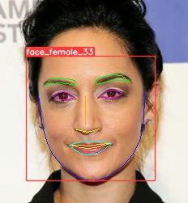

# 人脸多任务识别

# 项目说明

本项目为人脸多任务识别(单输入，多输出)，可以同时输出人脸关键点、性别和年龄。

采用了两个算法进行应用的实现，人脸目标检测和人脸多任务识别。

其中人脸目标检测采用YOLOV5进行实现，主要对人脸部分进行截取，再送入多任务网络进一步处理

本项目**不包含人脸目标检测的训练**，人脸目标检测训练相关内容和数据集参考我另一篇文章：[人脸目标检测](http://t.csdnimg.cn/wgkQF)

基于yolov5的人脸关键点检测(不含性别和年龄)可以参考文章：[人脸关键点检测](https://blog.csdn.net/z240626191s/article/details/140149666?spm=1001.2014.3001.5502)

------

# 项目使用说明

## 训练说明

### 数据集处理

数据集共计29055张图，数据集百度云：

百度云链接：https://pan.baidu.com/s/16Xv-ho-7wCvbxH3PXb0X7w 
提取码：yypn 

注意这里的数据集标签采用的是json格式，这在训练中数据集处理和读取中十分不便利，因此我对该部分进行了优化，采用txt的格式进行读取，使得数据加载速度比之前快了至少10倍。

下载数据集并解压，比如我的数据集放在F:/mydatasets/下，目录形如：

```
mydatasets/
`-- wiki_crop_face
    |-- image
    |-- label_new
    |-- wiki_crop_face.txt


```

接下来进行如下步骤生成最终的txt标签

**步骤1：**

修改tools/JSON2TXT.py的如下路径：

```python
Json_label_path = 'F:/mydatasets/wiki_crop_face/label_new/'  # Json标签存储路径
Txt_label_path = 'F:/mydatasets/wiki_crop_face/label_txt/'   # Json转txt保存路径
```

然后**运行该脚本**，将会在wiki_crop_face/label_txt/下生成所有图像对应的标签txt文件，如下所示，命名方式为图像名称，内容为标注的信息。

```
|-- 3892342_1979-11-07_2009.txt
|-- 38929429_1993-02-22_2014.txt
|-- 38931826_1991-05-21_2013.txt
|-- 38932604_1982-09-28_2014.txt
|-- 3893481_1984-09-03_2011.txt
|-- 38940596_1990-02-19_2012.txt
.....
```

**步骤2：**

划分数据集，划分数据集脚本为tools/split_datasets.py,注意修改其中的步骤1得到的label_txt路径，然后**运行该脚本**即可，相关功能解释可看代码中注解介绍。

函数说明：

脚本中的create_dataset函数是将步骤1中得到的label_txt文件夹中所有的txt信息写入到一个txt中—datasets_list.txt。

脚本中的split_datasets函数是将上一步的datasets_list.txt划分为训练集train_list.txt和val_list.txt。

最终得到的数据集目录如下：

```
wiki_crop_face/
|-- datasets_list.txt  # 存储了所有数据集信息
|-- image  # 所有图像
|-- label_new  # 所有标签的json格式
|-- label_txt  # 所有标签的txt格式
|-- train_list.txt  # 训练集list
|-- val_list.txt  # 验证集list
`-- wiki_crop_face.txt  
```

### 训练

开启快速训练(其他参数可以看train.py)

```
python train.py --train_path 你的train_list.txt路径 --val_path 你的val_list.txt路径 --batch_size 8
```

ps:代码参数中的model参数是Backbone，现仅支持resnet34、resnet50（默认为resnet34）

## 检测

**该部分有偿提供**

开启快速检测

```
python predict.py --source img/2.jpg --yolo_weight yolo权重 --face_multask_weights 多任务权重 --draw_points
```

检测效果如下：




权重链接：

权重链接百度云：https://pan.baidu.com/s/10w4h2-76rfitbRVlONIbEw 
提取码：yypn 
